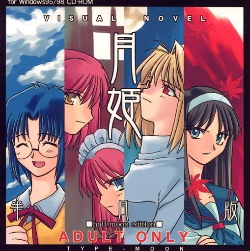
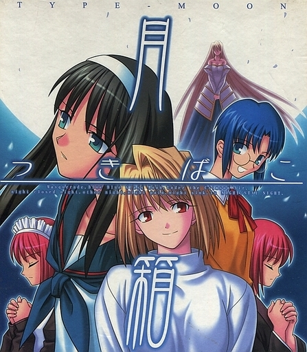
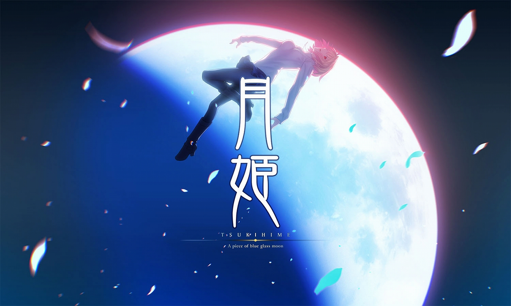
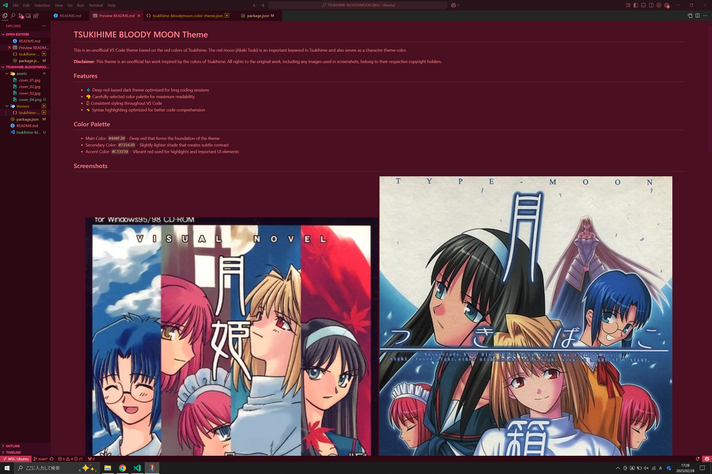

# TSUKIHIME BLOODY MOON Theme

This is an unofficial VS Code theme based on the red colors of Tsukihime. 
The red moon (Akaki Tsuki) is an important keyword in Tsukihime and also serves as a character theme color.

**Disclaimer**: This theme is an unofficial fan work inspired by the colors of Tsukihime. All rights to the original work, including any images used in screenshots, belong to their respective copyright holders.

## Features

- 💠 Deep red-based dark theme optimized for long coding sessions
- 🎨 Carefully selected color palette for maximum readability
- 🖥 Consistent styling throughout VS Code
- ⚡ Syntax highlighting optimized for better code comprehension

## Color Palette

- Main Color: `#4A0F20` - Deep red that forms the foundation of the theme
- Secondary Color: `#72163D` - Slightly lighter shade that creates subtle contrast
- Accent Color: `#C33150` - Vibrant red used for highlights and important UI elements

## Screenshots

  
  

  

  

## Installation

1. Open the **Extensions** sidebar panel in VS Code (`Ctrl+Shift+X` or `Cmd+Shift+X`)
2. Search for `TSUKIHIME BLOODY MOON`
3. Click **Install**
4. Click **Reload** to reload the editor
5. Code > Preferences > Color Theme > **TSUKIHIME BLOODY MOON**

## Feedback

- If you have suggestions or issues, please open an Issue on the [GitHub repository](https://github.com/KunihiroS/TSUKIHIME-BLOODYMOON)

## Version History

### 0.0.1
- Initial release
- Implementation of dark theme based on Tsukihime's red colors
- Carefully selected highlight colors for optimal readability

## License

The source code for this theme is released under the MIT License.

Note: This license applies only to the theme code and color settings. Any screenshot images used in documentation are for demonstration purposes only and are the property of their respective copyright holders.